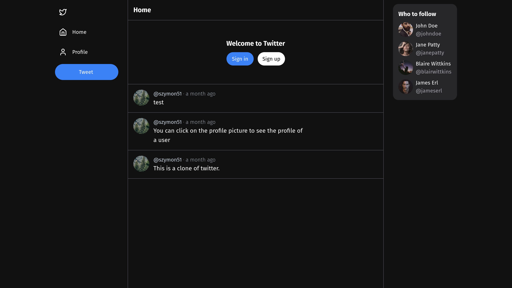

# Twitter-clone

You can see the live website at [https://twitter-clone-szymon51.vercel.app/](https://twitter-clone-szymon51.vercel.app/)

This is a clone of twitter created with the help of a [T3 Stack](https://youtu.be/YkOSUVzOAA4) tutorial by Theo. It has been modified to more closely resemble the original app.

## Technologies used:

- [Next.js](https://nextjs.org)
- [Prisma](https://prisma.io)
- [Tailwind CSS](https://tailwindcss.com)
- [tRPC](https://trpc.io)
- [clerk](https://clerk.com/)
